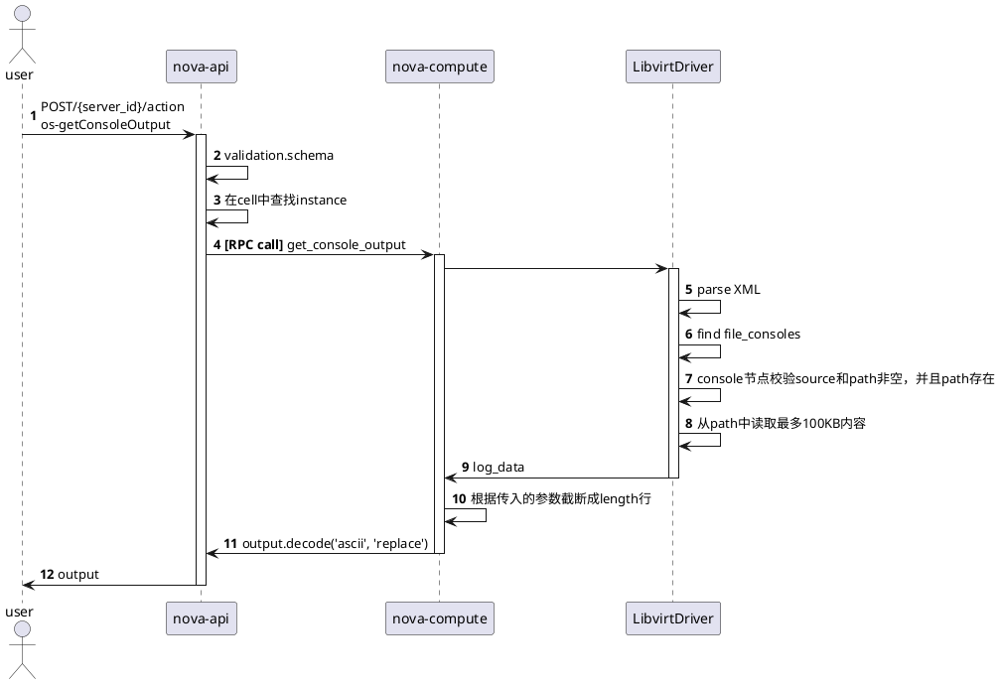

# 展示虚拟机的控制台输出

API文档：https://docs.openstack.org/api-ref/compute/?expanded=show-console-output-os-getconsoleoutput-action-detail#show-console-output-os-getconsoleoutput-action

在[OpenStack Virtual Machine Image Guide](https://docs.openstack.org/image-guide/)中，[要求](https://docs.openstack.org/image-guide/openstack-images.html#ensure-image-writes-boot-log-to-console)将`console=tty0 console=ttyS0,115200n8`加入到虚拟机内核的启动参数中

在虚拟机创建的过程中，如果`CONF.serial_console.enabled`设置为`True`(默认值)，那么生成xml时会生成如下配置(_create_serial_consoles)
```xml
    <serial type="pty">
      <log file="/var/lib/nova/instances/9d16ac08-81b3-445b-b352-22c950f14150/console.log" append="off"/>
    </serial>
```
由于libvirt的兼容性设置，最终虚拟机运行起来后，xml中会有如下字段
```xml
    <serial type='pty'>
      <source path='/dev/pts/0'/>
      <log file='/var/lib/nova/instances/6acf82da-d9b0-4e76-82e5-e524d0b86368/console.log' append='off'/>
      <target type='isa-serial' port='0'>
        <model name='isa-serial'/>
      </target>
      <alias name='serial0'/>
    </serial>
    <console type='pty' tty='/dev/pts/0'>
      <source path='/dev/pts/0'/>
      <log file='/var/lib/nova/instances/6acf82da-d9b0-4e76-82e5-e524d0b86368/console.log' append='off'/>
      <target type='serial' port='0'/>
      <alias name='serial0'/>
    </console>
```

这样在虚拟机内的console就会重定向至ttyS0，然后宿主机侧的virtlogd会将内容写到指定的文件中

在请求API接口时，流程如下
