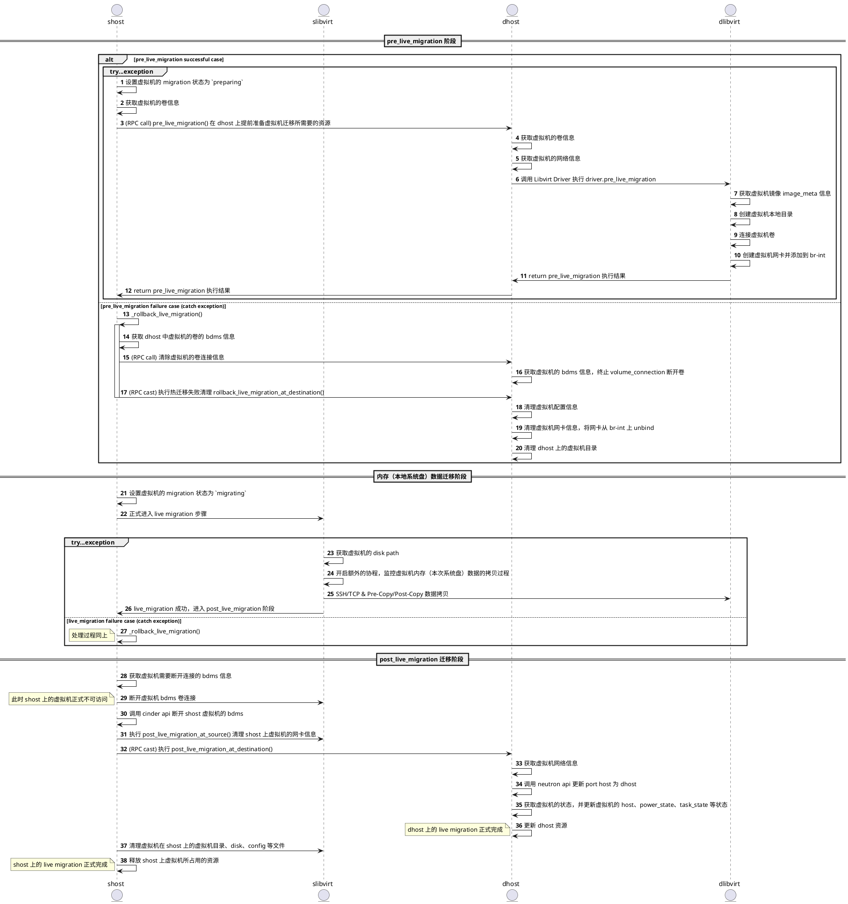
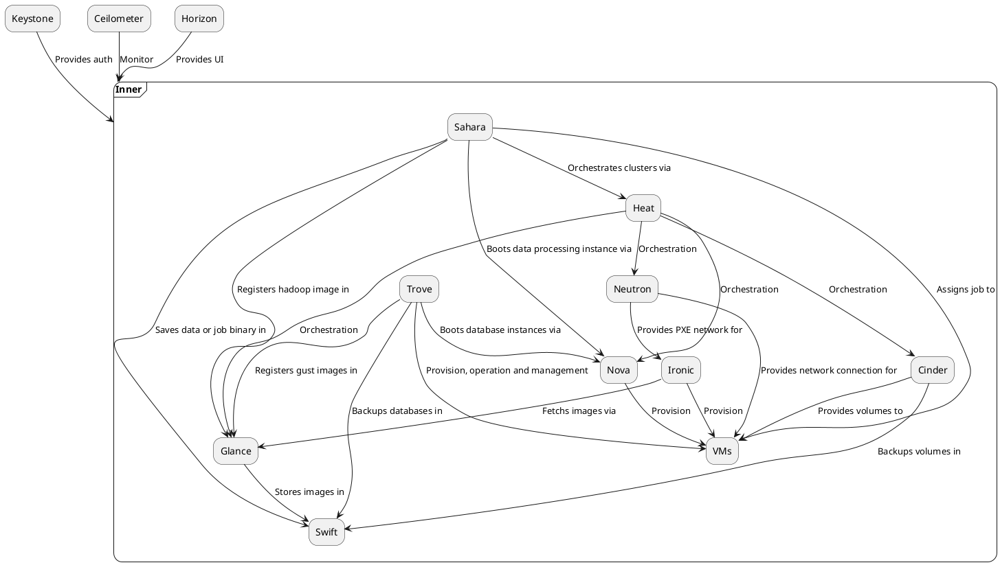

# 测试plantuml

```plantuml
@startuml
autonumber

entity shost
entity slibvirt
entity dhost
entity dlibvirt

== pre_live_migration 阶段 ==
alt pre_live_migration successful case
  group try...exception
    shost -> shost: 设置虚拟机的 migration 状态为 `preparing`
    shost -> shost: 获取虚拟机的卷信息
    shost -> dhost: (RPC call) pre_live_migration() 在 dhost 上提前准备虚拟机迁移所需要的资源
    dhost -> dhost: 获取虚拟机的卷信息
    dhost -> dhost: 获取虚拟机的网络信息
    dhost -> dlibvirt: 调用 Libvirt Driver 执行 driver.pre_live_migration
    dlibvirt -> dlibvirt: 获取虚拟机镜像 image_meta 信息
    dlibvirt -> dlibvirt: 创建虚拟机本地目录
    dlibvirt -> dlibvirt: 连接虚拟机卷
    dlibvirt -> dlibvirt: 创建虚拟机网卡并添加到 br-int
    dlibvirt -> dhost: return pre_live_migration 执行结果
    dhost -> shost: return pre_live_migration 执行结果
  end
else pre_live_migration failure case (catch exception)
  shost -> shost: _rollback_live_migration()
  activate shost
    shost -> shost: 获取 dhost 中虚拟机的卷的 bdms 信息
    shost -> dhost: (RPC call) 清除虚拟机的卷连接信息
    dhost -> dhost: 获取虚拟机的 bdms 信息，终止 volume_connection 断开卷
    shost -> dhost: (RPC cast) 执行热迁移失败清理 rollback_live_migration_at_destination()
  deactivate shost
    dhost -> dhost: 清理虚拟机配置信息
    dhost -> dhost: 清理虚拟机网卡信息，将网卡从 br-int 上 unbind
    dhost -> dhost: 清理 dhost 上的虚拟机目录
end


== 内存（本地系统盘）数据迁移阶段 ==
shost -> shost: 设置虚拟机的 migration 状态为 `migrating`
shost -> slibvirt: 正式进入 live migration 步骤
alt live_migration successful case
  group try...exception
    slibvirt -> slibvirt: 获取虚拟机的 disk path
    slibvirt -> slibvirt: 开启额外的协程，监控虚拟机内存（本次系统盘）数据的拷贝过程
    slibvirt -> dlibvirt: SSH/TCP & Pre-Copy/Post-Copy 数据拷贝
    slibvirt -> shost: live_migration 成功，进入 post_live_migration 阶段
else live_migration failure case (catch exception)
  shost -> shost: _rollback_live_migration()
  note left: 处理过程同上
end


== post_live_migration 迁移阶段 ==
shost -> shost: 获取虚拟机需要断开连接的 bdms 信息
shost -> slibvirt: 断开虚拟机 bdms 卷连接
note left: 此时 shost 上的虚拟机正式不可访问
shost -> shost: 调用 cinder api 断开 shost 虚拟机的 bdms
shost -> slibvirt: 执行 post_live_migration_at_source() 清理 shost 上虚拟机的网卡信息
shost -> dhost: (RPC cast) 执行 post_live_migration_at_destination()
dhost -> dhost: 获取虚拟机网络信息
dhost -> dhost: 调用 neutron api 更新 port host 为 dhost
dhost -> dhost: 获取虚拟机的状态，并更新虚拟机的 host、power_state、task_state 等状态
dhost -> dhost: 更新 dhost 资源
note left: dhost 上的 live migration 正式完成
shost -> slibvirt: 清理虚拟机在 shost 上的虚拟机目录、disk、config 等文件
shost -> shost: 释放 shost 上虚拟机所占用的资源
note left: shost 上的 live migration 正式完成
@enduml
```

```plantuml
@startuml
skinparam roundcorner 25

rectangle Keystone
rectangle Ceilometer
rectangle Horizon

Keystone -down-> Inner : Provides auth
Ceilometer -down-> Inner : Monitor
Horizon -down-> Inner : Provides UI

frame "Inner" {
    rectangle Glance
    rectangle Nova
    rectangle Sahara
    rectangle Swift
    rectangle VMs
    rectangle Neutron
    rectangle Cinder
    rectangle Ironic
    rectangle Trove
    rectangle Heat
}

Glance --> Swift: Stores images in

Nova --> VMs: Provision

Sahara --> Glance: Registers hadoop image in
Sahara --> Nova: Boots data processing instance via
Sahara --> VMs: Assigns job to
Sahara --> Swift: Saves data or job binary in
Sahara --> Heat: Orchestrates clusters via

Neutron --> Ironic: Provides PXE network for
Neutron --> VMs: Provides network connection for

Ironic --> Glance: Fetchs images via
Ironic --> VMs: Provision

Trove --> Nova: Boots database instances via
Trove --> VMs: Provision, operation and management
Trove --> Swift: Backups databases in
Trove --> Glance:Registers gust images in

Heat --> Glance: Orchestration
Heat --> Nova: Orchestration
Heat --> Neutron: Orchestration
Heat --> Cinder: Orchestration

Cinder --> VMs: Provides volumes to
Cinder --> Swift: Backups volumes in
@enduml
```